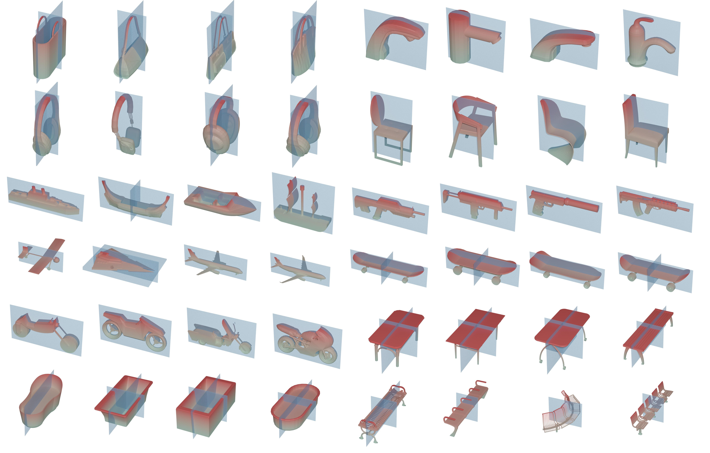

# E3Sym: Leveraging E(3) Invariance for Unsupervised 3D Planar Reflective Symmetry Detection

Official implementation of our ICCV 2023 paper: E3Sym: Leveraging E(3) Invariance for Unsupervised 3D Planar Reflective Symmetry Detection.



## Abstract

Detecting symmetrical properties is a fundamental task in 3D shape analysis. In the case of a 3D model with planar symmetries, each point has a corresponding mirror point w.r.t. a symmetry plane, and the correspondences remain invariant
under any arbitrary Euclidean transformation. Our proposed method, E3Sym, aims to detect planar reflective symmetry in an unsupervised and end-to-end manner by leveraging E(3) invariance. E3Sym establishes robust point correspondences through the use of E(3) invariant features extracted from a lightweight neural network, from which the dense symmetry prediction is produced. We also introduce a novel and efficient clustering algorithm to aggregate the dense rediction and produce a detected symmetry set, allowing for the detection of an arbitrary number of planar symmetries while ensuring the method remains differentiable for end-to-end training. Our method also possesses the ability to infer reasonable planar symmetries from incomplete shapes, which remains challenging for existing methods. Extensive experiments demonstrate that E3Sym is both effective and robust, outperforming state-of-the-art methods.

## Installation
```bash
conda create -n dev python=3.7.13
conda activate dev
pip install -r requirements.txt
```

## Data
Download [ShapeNetCore.v2](https://shapenet.org/) into dataset/ShapeNetCore.v2, the directory structure shoule be as follows:
```
dataset/ShapeNetCore.v2
├── 02691156
├── 02747177
├── 02773838
├── 02801938
├── 02808440
├── 02818832
├── 02828884
├── 02843684
├── 02871439
├── 02876657
├── 02880940
├── 02924116
├── 02933112
├── 02942699
├── 02946921
├── 02954340
├── 02958343
├── 02992529
├── 03001627
├── 03046257
├── 03085013
├── 03207941
├── 03211117
├── 03261776
├── 03325088
├── 03337140
├── 03467517
├── 03513137
├── 03593526
├── 03624134
├── 03636649
├── 03642806
├── 03691459
├── 03710193
├── 03759954
├── 03761084
├── 03790512
├── 03797390
├── 03928116
├── 03938244
├── 03948459
├── 03991062
├── 04004475
├── 04074963
├── 04090263
├── 04099429
├── 04225987
├── 04256520
├── 04330267
├── 04379243
├── 04401088
├── 04460130
├── 04468005
├── 04530566
└── 04554684

55 directories, 0 files
```

## Train
```bash
bash run_train.sh
```

## Inference
```bash
bash run_test.sh
```

## Acknowledgement
Some code are borrowed from [PRS-Net](https://github.com/IGLICT/PRS-NET), [dps](https://github.com/benbergner/dps) and [pytorch3d](https://github.com/facebookresearch/pytorch3d), thanks for these great projects!

## Citation
If you find our work useful in your research, please consider citing:
```
@inproceedings{e3sym,
        author      = {Ren-Wu Li, Ling-Xiao Zhang, Chun-Peng Li, Yu-Kun Lai and Lin Gao},
        title       = {E3Sym: Leveraging E(3) Invariance for Unsupervised 3D Planar Reflective Symmetry Detection},
        booktitle   = {ICCV},
        year        = {2023}
}
```
